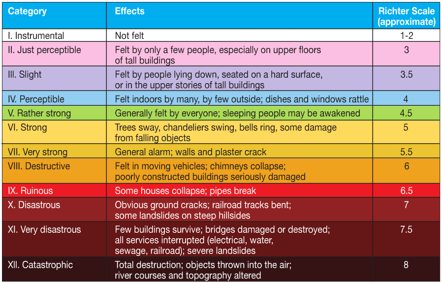

## What is Modified Mercalli Intensity?
 

* The effect of an earthquake on the Earth's surface is called the intensity. 
 

* The intensity scale consists of a series of certain key responses such as people awakening, movement of furniture, damage to chimneys, and finally - total destruction. 
 

* This scale, composed of increasing levels of intensity that range from imperceptible shaking to catastrophic destruction, is designated by Roman numerals. It does not have a mathematical basis; instead it is an arbitrary ranking based on observed effects.

 
 
Source: [USGS] (http://earthquake.usgs.gov/learn/topics/mercalli.php)

--- .class #id 

## How did you feel in a ground shaking?
 

This app describes the levels of Modified Mercalli intensity by characteristics of feelings picked from the bar. So,

* Choose how you felt during a seismic shaking. Pick the best description that fits to what you felt. 
 
* It tells you the coresponding Mercalli Intensity and whether it is severe enough for an alarm.
 
* It also depicts the feeling associated to the shaking level. This helps you visualize the experience.

--- &interactive

## The Modified Mercally Intensity Scale Identifier App

  

    <form class="well">
      

        <label class="control-label" for="feel">
          <h5 style="color:black">How did you feel it?</h5>
        </label>
        

          <select id="feel"><option value="Barely sensed only by a very few people." selected>Barely sensed only by a very few people.</option>
<option value="Felt only by a few people at rest in houses or on upper floors.">Felt only by a few people at rest in houses or on upper floors.</option>
<option value="Felt indoors as a light vibration. Hanging objects may swing slightly.">Felt indoors as a light vibration. Hanging objects may swing slightly.</option>
<option value="Generally noticed indoors, but not outside, as a moderate vibration or jolt. Light sleepers may be awakened. Walls may creak, and glassware, crockery, doors or windows rattle.">Generally noticed indoors, but not outside, as a moderate vibration or jolt. Light sleepers may be awakened. Walls may creak, and glassware, crockery, doors or windows rattle.</option>
<option value="Generally felt outside and by almost everyone indoors. Most sleepers are awakened and a few people alarmed. Small objects are shifted or overturned, and pictures knock against the wall. Some glassware and crockery may break, and loosely secured doors may swing open and shut.">Generally felt outside and by almost everyone indoors. Most sleepers are awakened and a few people alarmed. Small objects are shifted or overturned, and pictures knock against the wall. Some glassware and crockery may break, and loosely secured doors may swing open and shut.</option>
<option value="Felt by all. People and animals are alarmed, and many run outside. Walking steadily is difficult. Furniture and appliances may move on smooth surfaces, and objects fall from walls and shelves. Glassware and crockery break. Slight non-structural damage to buildings may occur.">Felt by all. People and animals are alarmed, and many run outside. Walking steadily is difficult. Furniture and appliances may move on smooth surfaces, and objects fall from walls and shelves. Glassware and crockery break. Slight non-structural damage to buildings may occur.</option>
<option value="People experience difficulty standing. Furniture and appliances are shifted. Substantial damage to fragile or unsecured objects. A few weak buildings are damaged.">People experience difficulty standing. Furniture and appliances are shifted. Substantial damage to fragile or unsecured objects. A few weak buildings are damaged.</option>
<option value="A few buildings are damaged and some weak buildings are destroyed.">A few buildings are damaged and some weak buildings are destroyed.</option>
<option value="Some buildings are damaged and many weak buildings are destroyed.">Some buildings are damaged and many weak buildings are destroyed.</option>
<option value="Many buildings are damaged and most weak buildings are destroyed.">Many buildings are damaged and most weak buildings are destroyed.</option>
<option value="Most buildings are damaged and many buildings are destroyed.">Most buildings are damaged and many buildings are destroyed.</option>
<option value="All buildings are damaged and most buildings are destroyed.">All buildings are damaged and most buildings are destroyed.</option></select>
          
        

      

      

        <h6 style="color:green">You felt:</h6>
         
        

         
        <h6 style="color:red">Which means the MMI scale of shaking was: </h6>
         
        

         
        

          Info. Source:
          <a href="http://www.gns.cri.nz/Home/Learning/Science-Topics/Earthquakes/Monitoring-Earthquakes/Other-earthquake-questions/What-is-the-difference-between-Magnitude-and-Intensity/The-Modified-Mercalli-Intensity-Scale">http://www.gns.cri.nz</a>
        

        

        

          Image Source:
          <a href="http://www.bmkg.go.id/BMKG_Pusat/Gempabumi_-_Tsunami/Gempabumi/Skala_MMI.bmkg">http://www.bmkg.go.id</a>
        

         
         
        

          App address:
          <a>http://mkhalegh.shinyapps.io/Modified-Mercalli-Intensity/</a>
        

      

    </form>
  

--- .class #id

## Applications of the app

This app can be useful for following purposes:

* Surveys: after ground shakings, seismologists would like to investigate the intensity felt by people. 
 
* Education: This simple app can be used in schools and for people in eartquake-prone areas, to learn more about seismic shaking intensities.
 
* Historical events: Using descriptions of feelings reported in books and journals from times that seismlogy was not advanced, helps estimating the seismic moments (in Richter scale).

